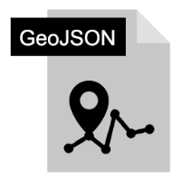

#  LES FORMATS 

##  Formats de données spatiales 
* ###  Raster  

  *  #### STATIQUES

 **_png :_**
 

Le Portable Network Graphics est un format ouvert d’images numériques, qui a été créé pour remplacer le format GIF, à l’époque propriétaire et dont la compression était soumise à un brevet. Le PNG est un format sans perte spécialement adapté pour publier des images simples comprenant des aplats de couleurs. Wikipédia

 **_jpeg :_**

JPEG est une norme qui définit le format d'enregistrement et l'algorithme de décodage pour une représentation numérique compressée d'une image fixe. Wikipédia

 **_geotiff :_**

Standard du domaine public permettant d'ajouter des informations de géoréférencement à une image TIFF. L'enregistrement des métadonnées de géoréférencement utilise la possibilité offerte par le format TIFF de pouvoir définir de l'information additionnelle sous forme de tags spécifiques. Wikipédia

 **_jpeg2000 :_** JPEG 2000 ou ISO/CEI 15444-1, abrégé JP2, est une norme de compression d’images commune à l’ISO, la CEI et l’UIT-T. Grâce à sa compression supérieure au simple jpeg, il peut proposer des images avec une résolution beaucoup plus fine. Le format permet l’intégration d’information de sig.

 **_cog :_**Le format COG est un geotiff spécialement organisé pour pourvoir être utilisé à distance via le protocole HTTP, sans avoir à télécharger les fichiers en entiers

 **_mbtiles :_** est un format de tuiles cartographiques rasters et vectorielles. Il repose en fait sur une base de données SQLite qui permet de stocker toute une pyramide de tuiles en un seul fichier. Très utilisé pour des applications offline.

 **_ecw :_**

Est un format propriétaire ERDAS ER Mapper. Il s'agit d'une compression par ondelettes sans perte, semblable à JPEG 2000.

  *   ####  FLUX 

 **_wms :_**
 

Web Map Service ou WMS est un service standard qui permet d'obtenir des rasters de données géoréférencées à partir de différents serveurs de données.

 **_wmts :_** est un service standard qui permet d'obtenir des rasters de données géoréférencées découper en plusieurs tuiles à partir de différents serveurs de données. 

 **_wcs :_**
 

Le Web Coverage Service Interface Standard (WCS) de l'OGC est un standard fournissant une interface permettant de télécharger des données de type couverture (modèle numérique de terrain, orthoimages, prévision numérique du temps).

 **_tms :_**

 **_xyz :_**

* ###  Vecteur 

  *   ####  STATIQUES 

 **_geojson :_**
 

permet d’encoder les structures classiques de données géographiques (point, lignes, surfaces), de manière très légère, tout en respectant la syntaxe objet JavaScript (JSON). C’est donc certainement le format le plus utilisé sur le web.

 **_topojson :_** est similaire à GeoJSON, mais stocke les données de manière topologique, et donc permet un gain de poids non négligeable pour des données jointes. Cependant, ce format est moins bien supporté par défaut.

 **_gpx :_** “GPS eXchange Format” est un format de fichier permettant de sauvegarder et de suivre un itinéraire en temps réel. Il s’agit d’un tracé de parcours facilité par la géolocalisation d’un téléphone mobile.

 **_kml :_**
 

Le format KML est un standard international de données géographiques ouvert, proposé par Google et adopté par l'OGC (Open Geospatial Consortium) en 2007. C'est un langage basé sur le XML, adapté aux données géographiques. C'est le format de données géographiques utilisé dans Google Earth et Google Maps. 
Les coordonnées sont exprimées en degrés décimaux (longitude et latitude, dans cet ordre) dans le système de référence WGS84 (EPSG:4326). Une couche KML est une couche géographique vectorielle de points, de polylignes ou de polygones.

 **_wkt :_** est un format de représentation textuelle des géométries spatiales. Il existe une version binaire nommée WKB (Well-Known Binary).

 **_geoRSS :_** est un standard destiné à inclure les coordonnées géographiques dans un flux RSS, format XML qui est utilisé pour décrire les flux de contenu, tels que des articles, des listes de fichiers MP3, de billets de blog,...

 **_geopackage :_** Base de données fichier standard de l’OGC. Il possède de nombreux avantages tels les tailles et longueurs illimités pour les données. Ce format sous forme de fichiers permet de faciliter les échanges et possède certains avantages d’une base de données relationnelle classique.

 **_shapefile :_**
 

Ancien fichier propriétaire d’Esri devenu pendant longtemps le standard pour les données vecteurs. Le format possède de nombreuses contraintes telles qu’un poids limité et des longueurs de nom de champs limitées et autres.

 **_tab :_**  Même chose que le shapefile mais version  

 **_vrt :_** fichier virtuel qui affiche le résultat d’une requête d’une donnée existante sur le serveur sous forme de vue. 

  *   ####  FLUX 

 **_wfs :_**
 

Service qui permet d’afficher et d'interroger les données vecteurs stockées sur un autre serveur.

 **_wts :_** Un service de terrain web (WTS) fournit des données topographiques ou d'élévation à des applications de cartographie en ligne. Ces données sont souvent utilisées pour créer des représentations visuelles du terrain dans les applications de cartographie en ligne

 **_wfs-t :_**

Le WFS-T est une extension du service WFS (Web Feature Service), qui permet non seulement de récupérer des données spatiales (telles que des entités géographiques), mais également de les modifier, d'ajouter de nouvelles entités ou de supprimer des entités existantes sur le serveur de données géographiques

##  Format de fichiers  

  **_csv :_**

fichier texte représentant des données tabulaires qui sépare chaque colonne par un caractère spécial type ‘,’ ou ‘;’

 **_pdf :_**
 

Le PDF est un langage de description de page présenté devenu une norme ISO en 2008.

La spécificité du PDF est de préserver la mise en page d’un document — polices de caractères, images, objets graphiques, etc. — telle qu'elle a été définie par son auteur, et cela quels que soient le logiciel, le système d'exploitation et l'ordinateur utilisés pour l’imprimer ou le visualiser.

 **_excel :_** format de tableur de open office

 **_wkt :_**
 

WKT (Well-Known Text) est un format de représentation textuelle des géométries spatiales. Il existe une version binaire nommée WKB (Well-Known Binary).

##  Format de web 

 **_html :_**
 

  HyperText Markup Language  que l’on peut traduire par « langage de balises pour l'hypertexte » est utilisé afin de créer et de représenter le contenu d'une page web et sa structure. Il permet d’annoter du texte, des images et d'autres contenus afin de les afficher dans un navigateur web. D'autres technologies sont utilisées avec HTML pour décrire la présentation d'une page (CSS) et/ou ses fonctionnalités interactives (JavaScript).
 
 **_php :_** 
 

Hypertext Preprocessor est un langage de scripts généraliste et Open Source, spécialement conçu pour le développement d'applications web.

 **_css :_**
 

Cascading Style Sheets ce qui signifie « feuille de style en cascade ».
Il correspond à un langage informatique permettant de mettre en forme des pages web (HTML ou XML).

 **_Javascript :_**  langage de programmation permettant de créer du contenu mis à jour de façon dynamique, de contrôler le contenu multimédia et d'animer des images.

 **_python :_** langage de programmation interprété et multiplateformes. Il favorise la programmation impérative structurée, fonctionnelle et orientée objet.

##  Métadonnées  

 **_xml :_** langage sous forme de balise 

##  Format base de données  

 **_postgres :_** Système de base de données relationnelle opensource qui permet de gérer les données sous formes de schémas et de table. Il permet de gérer aussi les utilisateurs sous forme de groupe de rôles et possède une extension spatiale postgis qui permet de gérer des données de sig avec de nombreuses fonctions.

 **_oracle :_** : Système de base de données relationnelle opensource propriétaire. Même principe que postgres c’est juste payant.

